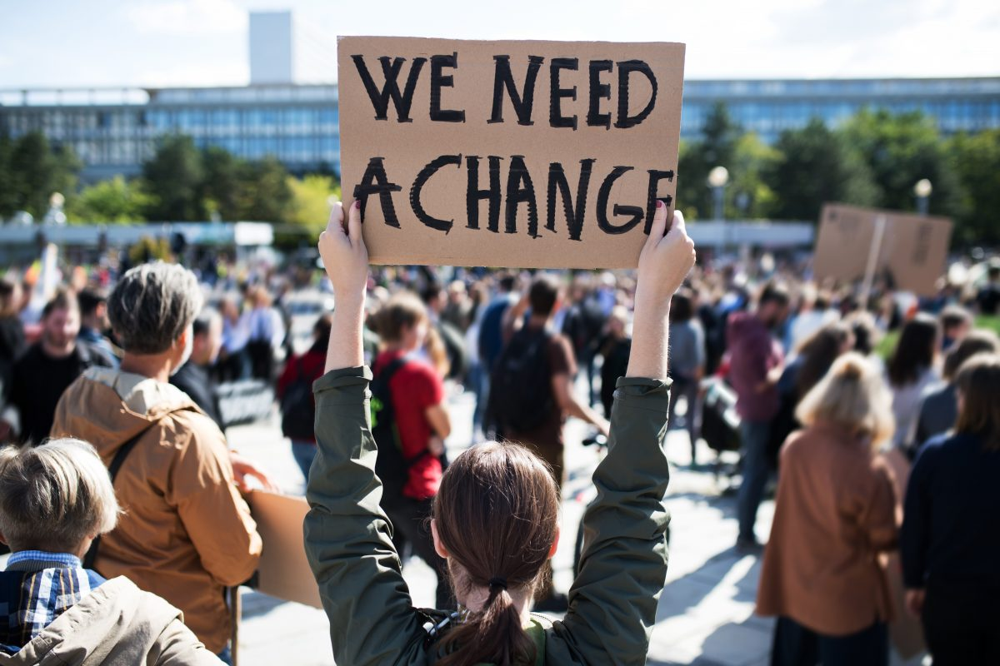

# Activist-Community
> Activist Coimmunity is a Web App enabling people to publicly express their objection to creative tax avoidance, unfair
employment practices, racism, disregard of environmental impact and other
unethical business and political practices.
> Live demo [_here_](https://github.com/lmarasa1/Activist-Community/blob/main/Images/74850_Luca_Marasa_demo_1635715_195983811.webm). <!-- If you have the project hosted somewhere, include the link here. -->

## Table of Contents
* [Introduction](#Introduction)
* [Technologies Used](#technologies-used)
* [Features](#features)
* [Screenshots](#screenshots)
* [Setup](#setup)
* [Project Status](#project-status)
* [Contact](#contact)
<!-- * [License](#license) -->

## Introduction
The aim of the project is to allow users to sign up and create petitions relating to various social justice topics that can be viewed and signed by other users. To that end end a full stack website was developed where using various front end and back-end technologies. This project was part of a peice of coursework that attempted to asess how well those various technologies were learnt.

- What problem does it (intend to) solve?
- What is the purpose of your project?
- Why did you undertake it?
<!-- You don't have to answer all the questions - just the ones relevant to your project. -->

## Technologies Used
- Java Script - ECMAScript 2018
- HTML5
- CSS3
- ASP.Net MVC and razer view
- C# - version 10
- Bootstrap
- JQuery

## Features

- Ability to create a member accounts
- Members can create new petitions
- Can electronically sign any petition using a member's account
- There is a special “Admin” account which can delete Causes
- A list of names of those who have signed a petition is visible to anyone
- A counter of how many people have signed a petition visible to anyone
- Ability to see signature counts and actual new signatures as they happen
- Ability to share causes on Facebook.
 

## Screenshots

<!-- If you have screenshots you'd like to share, include them here. -->

## Setup
Requires installation of Visual Studio 2022 . Project can be started from Visual Studio by cloning the repository with the link: https://github.com/lmarasa1/Activist-Community.

## Project Status
Project is no longer being worked on as it was part of an assesment.

## Contact
Created by [email](mailto:lmarasa1@yahoo.co.uk) - feel free to contact me!

<!-- Optional -->
<!-- ## License -->
<!-- This project is open source and available under the [... License](). -->

<!-- You don't have to include all sections - just the one's relevant to your project -->
